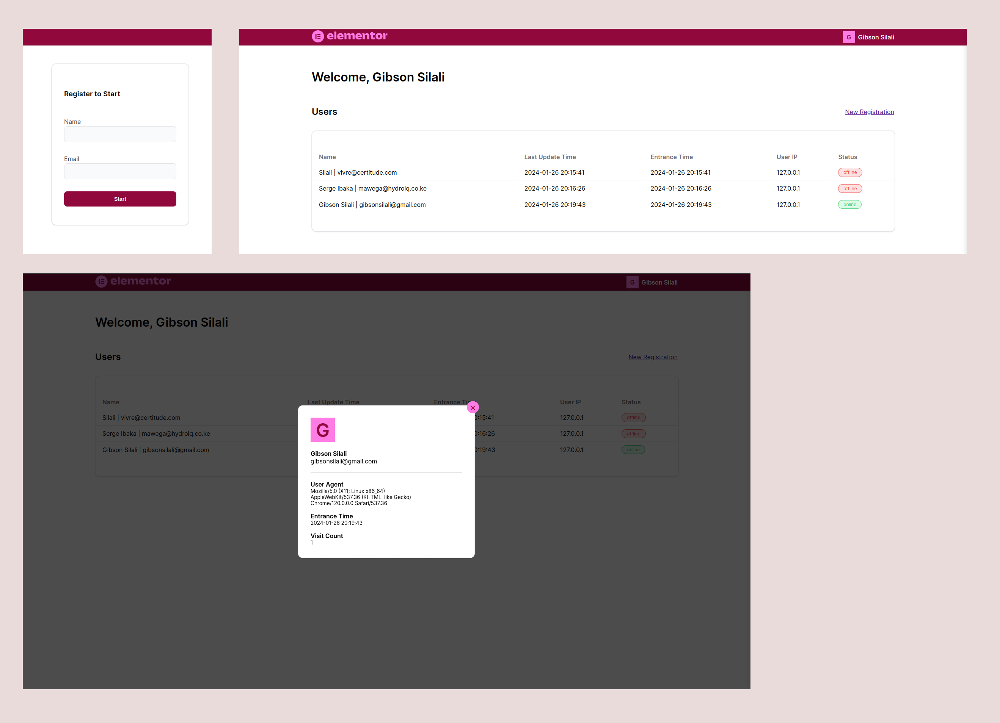

# Live Users Dashboard

A JavaScript application that shows current online users.

## Tech stack

- **Frontend** - ES6 JavaScript, SCSS and HTML with a nodejs server
- **Backend** - PHP with a text file database
- **Unit tests** - jest

## User online status tracking

I use localStorage and sessionStorage to track the online status of users.
All online users are stored in the `localStorage` and on tab closure, they are removed from `localStorage`.
`sessionStorage` is used to track the current user.

## Live demo

You can find the live demo Here at [https://oblong-turnip-frontend.fly.dev/](https://oblong-turnip-frontend.fly.dev/).

## Usage

- To start using this application go to [https://oblong-turnip-frontend.fly.dev/](https://oblong-turnip-frontend.fly.dev/).
- You will be directed to a registration page, where you are prompted for a name and email.
- On successful registration you will be redirected to the dashboard, where you will find a list of users with their online statuses.
- To register as another user click on the `New Registration` link, this will open a new tab allowing you to test the application.
- You can click on a table row to open a modal that shows user details

## Directories

`backend` - contains the PHP REST API for updating and fetching users
`frontend` - contains a javascript application served by on nodejs server.

## Hosting

The app is hosted on Fly.io
